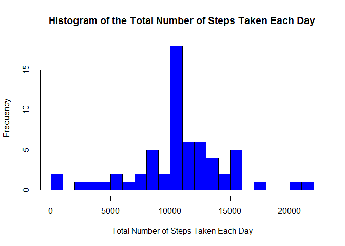

# Reproducible Research: Peer Assessment 1

#### Atul Verma/ atul62.verma@gmail.com
## Loading and preprocessing the data
#### 1) Load the data (i.e. read.csv())

The following code chunk checks whether data needs to be downloaded and downloads the data if needed.  


```r
load.data <- function(wd, lf = T, fu, fn, it = "csv", uf = F, zf, ... ){
        # set working directory
        setwd(wd)

        # check if data folder exists and create it if not
        if(!file.exists("./data")){ dir.create("./data") }

        # create variable to store local file path
        df <- paste0("./data/", fn)

        # download the file
        if(lf == F){ download.file(fu, destfile = df) }

        # unzip the file
        unzip(zf, exdir = "./data")

        # read the data using the indicated import type
        if(it == "csv"){ x <- read.csv(df) }

        # return data.frame
        return(x)
}
```
Loading the course data file into a dataframe called "activity".  


```r
activity <- load.data(
        getwd(),
        lf = T,
        "N/A",
        "activity.csv",
        it = "csv",
        uf = T,
        "activity.zip"
        )
```


```r
        names(activity)
```

```
## [1] "steps"    "date"     "interval"
```

```r
        str(activity)
```

```
## 'data.frame':	17568 obs. of  3 variables:
##  $ steps   : int  NA NA NA NA NA NA NA NA NA NA ...
##  $ date    : Factor w/ 61 levels "2012-10-01","2012-10-02",..: 1 1 1 1 1 1 1 1 1 1 ...
##  $ interval: int  0 5 10 15 20 25 30 35 40 45 ...
```


### 2) Process/transform the data (if necessary) into a format suitable for your analysis


```r
## subsetting data frame to values without na for later use
        without_na <- activity[complete.cases(activity),]
```


## What is mean total number of steps taken per day?
For this part of the assignment, the missing values in the dataset have been ignored.  


```r
        total <- aggregate(steps ~ date, without_na, sum)

##  Adding Descriptive variable names

        names(total)[2] <- "sum_steps"


## Checking out new data frame

        head(total, 5)
```

```
##         date sum_steps
## 1 2012-10-02       126
## 2 2012-10-03     11352
## 3 2012-10-04     12116
## 4 2012-10-05     13294
## 5 2012-10-06     15420
```


#### Plotting histogram, using breaks purely for better visuals.


```r
hist(
        total$sum_steps,
        col = "blue",
        main = "Histogram of the Total Number of Steps Taken Each Day",
        xlab = "Total Number of Steps Taken Each Day",
        breaks = 20
)
```

<!-- -->


## 3) Calculate and report the mean and median the total number of steps taken per day


```r
## mean
        mean(total$sum_steps)
```

```
## [1] 10766.19
```

```r
## median
        median(total$sum_steps)
```

```
## [1] 10765
```


## What is the average daily activity pattern?
1) Make a time series plot (i.e. type = “l”) of the 5-minute interval (x-axis) and the average number of steps taken, averaged across all days (y-axis)  


```r
## The average number of steps taken, averaged across all days for each 5-minute interval
        interval <- aggregate(steps ~ interval, without_na, mean)

## Adding descriptive variable names
        names(interval)[2] <- "mean_steps"

## Checking out new data frame
        head(interval, 5)
```

```
##   interval mean_steps
## 1        0  1.7169811
## 2        5  0.3396226
## 3       10  0.1320755
## 4       15  0.1509434
## 5       20  0.0754717
```

```r
## Formatting plot margins to accommodate long text labels.
        par(mai = c(1.2,1.5,1,1))

## Plotting time series
plot(
        x = interval$interval,
        y = interval$mean_steps,
        type = "l",
        main = "Time Series Plot of the 5-Minute Interval\n and the Average Number of Steps Taken, Averaged Across All Days",
        xlab = "5-Minute Interval",
        ylab = "Average Number of Steps Taken,\n Averaged Across All Days"
)
```

<!-- -->

## 2) Which 5-minute interval, on average across all the days in the dataset, contains the maximum number of steps?


```r
        interval[interval$mean_steps==max(interval$mean_steps),]
```

```
##     interval mean_steps
## 104      835   206.1698
```

The maximum number of steps is contained in the 835th 5-min interval (the previous graph, time series plot, also confirms this number).


## Imputing missing values
1) Calculate and report the total number of missing values in the dataset (i.e. the total number of rows with NAs)  


```r
        nrow(activity[is.na(activity$steps),])
```

```
## [1] 2304
```

#### 2) Devise a strategy for filling in all of the missing values in the dataset. The strategy does not need to be sophisticated. For example, you could use the mean/median for that day, or the mean for that 5-minute interval, etc.

I will use the mean for the 5-minute interval to populate NA values for a given interval.


## 3) Create a new dataset that is equal to the original dataset but with the missing data filled in.


```r
## Merging original activity data frame with interval data frame
        newactivity <- merge(activity, interval, by = 'interval', all.y = F)

## Merging NA values with averages rounding up for integers
        newactivity$steps[is.na(newactivity$steps)] <- as.integer(
        round(newactivity$mean_steps[is.na(newactivity$steps)]))

## Droping and reordering columns to match original activity data frame and called newactivity

        keeps <- names(activity)
        newactivity <- newactivity[keeps]
```

## 4) Make a histogram of the total number of steps taken each day and Calculate and report the mean and median total number of steps taken per day.


```r
## (total number of steps taken per day)
        newtotal <- aggregate(steps ~ date, newactivity, sum)

## adding descriptive variable names
        names(newtotal)[2] <- "sum_steps"

## checking out new data frame
        head(newtotal, 5)
```

```
##         date sum_steps
## 1 2012-10-01     10762
## 2 2012-10-02       126
## 3 2012-10-03     11352
## 4 2012-10-04     12116
## 5 2012-10-05     13294
```


```r
## plotting histogram, using breaks purely for better visuals.
hist(
        newtotal$sum_steps,
        col = "blue",
        main = "Histogram of the Total Number of Steps Taken Each Day",
        xlab = "Total Number of Steps Taken Each Day",
        breaks = 20
)
```

<!-- -->


```r
## mean
        mean(newtotal$sum_steps)
```

```
## [1] 10765.64
```


```r
## median
        median(newtotal$sum_steps)
```

```
## [1] 10762
```

### Do these values differ from the estimates from the first part of the assignment?

They do differ, but ever so slightly:

mean(total) = 10766.19, while mean(newtotal) = 10765.64. Rounding produces the same value.

median(total) = 10765, while median(newtotal) = 10762, which amounts to 3 step difference.  

### What is the impact of imputing missing data on the estimates of the total daily number of steps?

This seems to highly depend on how you imput the missing data. Since I used the average for a given interval, there was practically no difference because we basically pulled the averages closer to the inserted average value.  


## Are there differences in activity patterns between weekdays and weekends?
#### 1) Create a new factor variable in the dataset with two levels - “weekday” and “weekend” indicating whether a given date is a weekday or weekend day.


```r
## create new data frame
        newnewactivity <- newactivity

## set up logical/test vector

        weekend <- weekdays(as.Date(newnewactivity$date)) %in% c("Saturday", "Sunday")

## Fill in weekday column

        newnewactivity$daytype <- "weekday"

## replace "weekday" with "weekend" where day == Sat/Sun

newnewactivity$daytype[weekend == TRUE] <- "weekend"

## convert new character column to factor
        newnewactivity$daytype <- as.factor(newnewactivity$daytype)

## Check out new data frame
        str(newnewactivity)
```

```
## 'data.frame':	17568 obs. of  4 variables:
##  $ steps   : int  2 0 0 0 0 0 0 0 0 0 ...
##  $ date    : Factor w/ 61 levels "2012-10-01","2012-10-02",..: 1 54 28 37 55 46 20 47 38 56 ...
##  $ interval: int  0 0 0 0 0 0 0 0 0 0 ...
##  $ daytype : Factor w/ 2 levels "weekday","weekend": 1 1 2 1 2 1 2 1 1 2 ...
```

```r
        head(newnewactivity, 5)
```

```
##   steps       date interval daytype
## 1     2 2012-10-01        0 weekday
## 2     0 2012-11-23        0 weekday
## 3     0 2012-10-28        0 weekend
## 4     0 2012-11-06        0 weekday
## 5     0 2012-11-24        0 weekend
```

```r
## double check
        weekdays(as.Date(newnewactivity$date[3]))
```

```
## [1] "Sunday"
```
## 2) Make a panel plot containing a time series plot (i.e. type = “l”) of the 5-minute interval (x-axis) and the average number of steps taken, averaged across all weekday days or weekend days (y-axis).

The average number of steps taken, averaged across all days for each 5-minute interval:


```r
        newinterval <- aggregate(steps ~ interval + daytype, newnewactivity, mean)

## add descriptive variable names
        names(newinterval)[3] <- "mean_steps"

## check out new data frame
        head(newinterval, 5)
```

```
##   interval daytype mean_steps
## 1        0 weekday 2.28888889
## 2        5 weekday 0.40000000
## 3       10 weekday 0.15555556
## 4       15 weekday 0.17777778
## 5       20 weekday 0.08888889
```

#### Plotting time series


```r
library(lattice)
xyplot(
        mean_steps ~ interval | daytype,
        newinterval,
        type = "l",
        layout = c(1,2),
        main = "Time Series Plot of the 5-Minute Interval\nand the Average Number of Steps Taken,\nAveraged Across All Weekday Days or Weekend Days",
        xlab = "5-Minute Interval",
        ylab = "Average Number of Steps Taken"
)
```

<!-- -->

